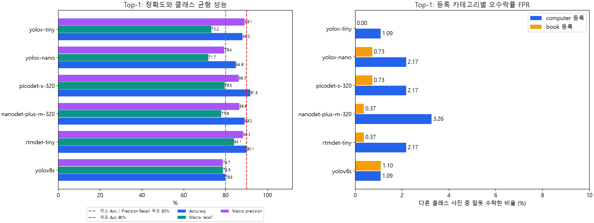
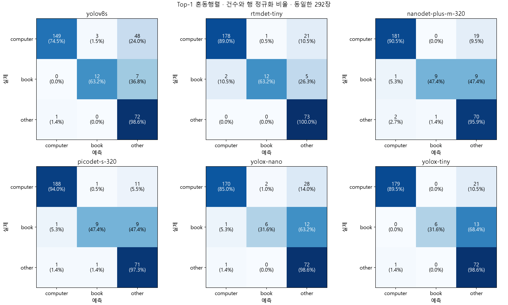
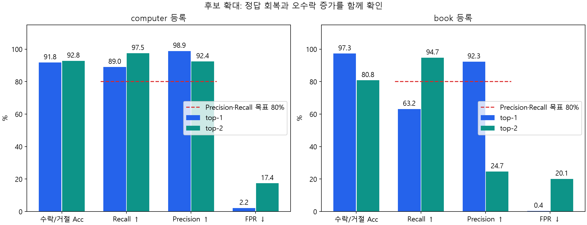
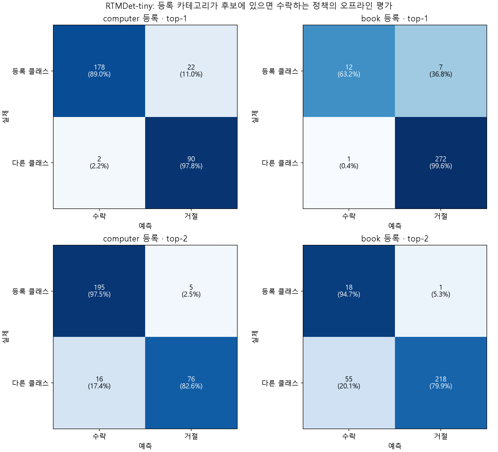
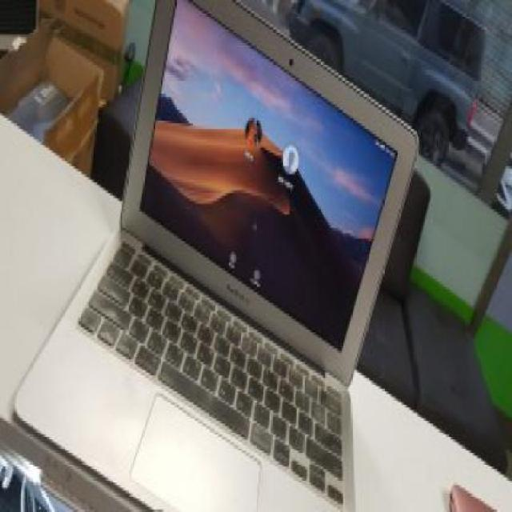
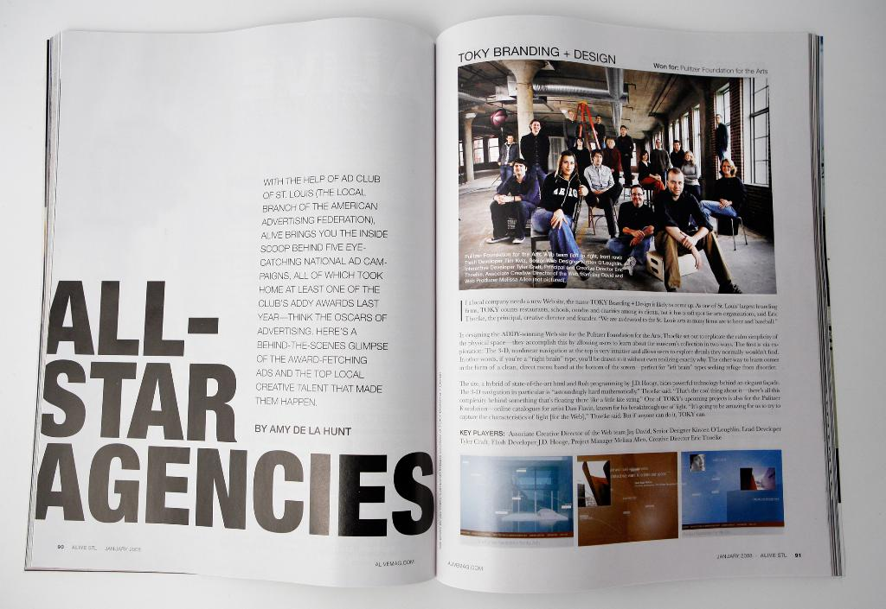
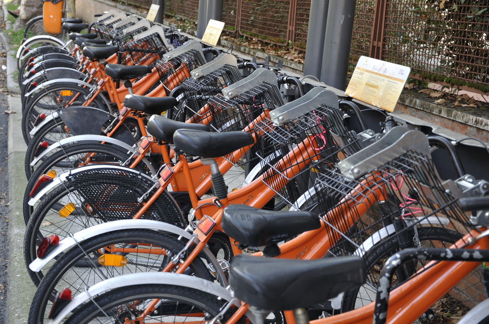
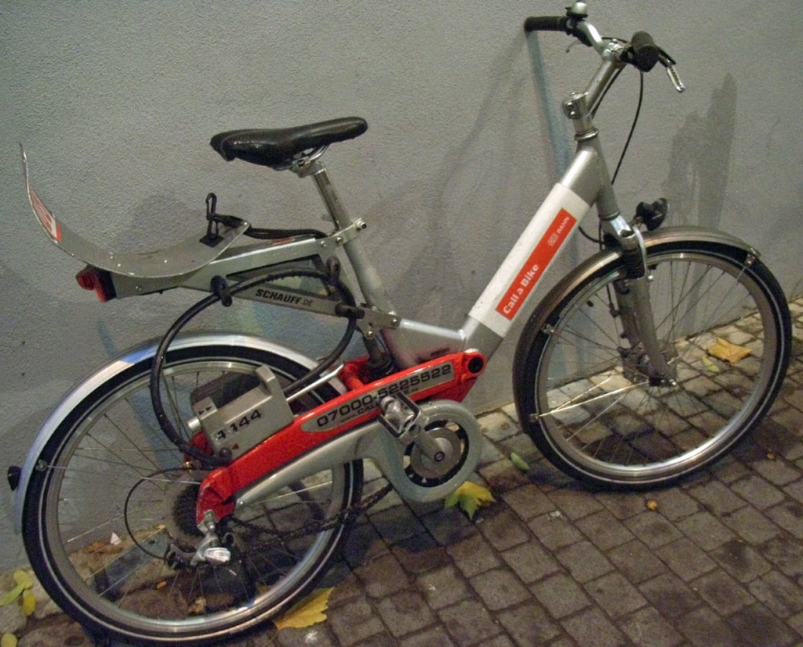

# F-03. 작업환경 행동 요구 — 사진 인증 AI 평가

## 1. 목적과 AI 엔지니어 담당 범위

사진 인증은 사용자가 **등록한 작업도구가 있는 환경으로 이동하도록 준비 행동을 요구하는 개입**입니다.
**실제 작업 시작을 증명하는 기능이 아닙니다.** 사진에서 도구가 보이는지 판정할 수 있어도,
사용자의 이동 여부·작업 시작·지속 여부까지 사진 한 장으로 확인하지는 못합니다.

AI 담당 범위는 제출된 사진과 등록 카테고리의 일치 여부를 평가하고, 판정 기준과 오류 특성을
서비스 팀에 제공하는 것입니다. 현재 저장소는 이를 위한 **오프라인 사전학습 모델 평가 코드**이며,
카메라 UI·인증 상태 저장·재시도 서비스가 구현됐다는 의미는 아닙니다.

| 사용자 흐름 | 서비스 동작 / AI 연동 요구 |
|---|---|
| 카메라 권한 허용 → 등록 작업도구 촬영 | 권한·촬영 UI는 앱 담당 |
| 제출 전 재촬영 → 사진 제출 | 앱/서버가 사진과 등록 카테고리를 전달 |
| 판정 결과 확인 | 성공 / 판정거절 / 기술오류를 구분해 표시 |
| 판정거절 후 재촬영·재제출 | 인증 가능 시간이 남아 있으면 허용 |
| 나중에 인증 화면에 재진입 | 인증 가능 시간이 남아 있으면 재시도 허용 |
| 성공 | 서버가 인증 완료 상태 기록 |

AI 연동에서 등록 카테고리에 맞는 도구로 판정하면 성공, 정상 처리됐지만 조건을 충족하지
못하면 판정거절로 다룹니다. 디코딩 실패·추론 실패 같은 기술오류는 판정거절 및 사용자
미인증과 분리해야 합니다. 인증 가능 종료 시점은 서비스 운영 정책에서 정합니다.

MVP에서는 목적 이해, 실제 도구 환경으로의 이동, 인증 부담, 인증 후 작업 시작,
인증 후 이탈, 판정 오류로 인한 시작 방해를 확인해야 합니다. 아래 AI 평가는 이 중
**판정 오류 위험**을 다루며, 나머지는 사용자 관찰과 서비스 로그로 확인해야 합니다.

## 2. 평가 조건과 MVP 목표

COCO 사전학습 경량 탐지 모델 6개의 top-1 결과와 RTMDet-tiny의 top-2 결과를 비교합니다.
모두 이름이 tiny인 모델은 아니며 nano/small 모델도 포함합니다. 별도 fine-tuning은 없었습니다.
이번 문서는 저장된 탐지 결과를 재집계했으며 학습·추론을 새로 실행하지 않았습니다.

| 항목 | 조건 |
|---|---|
| 평가 데이터 | 292장: computer 200, book 19, other 73 (bicycle 31 + guitar 42) |
| 정답 | 최상위 폴더의 단일 주 객체 라벨 |
| 등록 카테고리 | computer, book; other는 비대상 평가 그룹 |
| 그룹 매핑 | COCO laptop/tv → computer, book → book, 나머지 → other |
| 후보 점수 | 그룹 내 최대 confidence; 합산·재정규화하지 않음 |
| 임계값 | 그룹별 0.05, 탐지 confidence 0.01, 설정 NMS IoU 0.6 |
| 실행 환경 | CPU, 모델별 기본 입력 크기·후처리 사용 |
| 평가 범위 | 이미지 분류·등록 카테고리 판정; 바운딩 박스 mAP 아님 |

NanoDet/PicoDet는 native head/export 후처리를 사용하며 최소 점수는 각각 0.05/0.025입니다.
모델별 입력 크기와 후처리가 달라 동일 구조·동일 연산량의 비교는 아닙니다.

Acc는 기존 목표를 유지하고, Precision·Recall 목표는 각각 80% 이상으로 설정했습니다.
FNR·FPR은 AI 담당자가 각각 5% 이하를 제안하며 **PO 확정 전**입니다.

| 기준 | 목표 | 현재 판단 범위 |
|---|---:|---|
| 전체 단일 예측 Accuracy | 목표 ≥90%, 최소 ≥80% | Top-1 이미지 평가로 확인 |
| Precision | ≥80% | 모델 비교는 macro 평균, 인증 검증은 등록 카테고리별로 확인 |
| Recall | ≥80% | 모델 비교는 macro 평균, 인증 검증은 등록 카테고리별로 확인 |
| FPR / FNR | 각각 ≤5% 제안 | PO가 최종 수치·집계 단위·적용 범위를 결정 |
| 성능 개선 한계 시 우선순위 | Acc ≥80%를 최우선으로 제안 | PO 승인 대기; 다른 목표의 자동 면제를 의미하지 않음 |

기존 실행 설정의 세션 수락 오류 5%·거절 오류 20%는 과거 기준으로 보존합니다.
현재 승인된 FNR·FPR 목표로 간주하지 않습니다. PO가 이미지/세션 단위와 카테고리별 또는
전체 집계 여부를 함께 정해야 합니다. 이미지 FNR ≤5%를 채택하면 같은 단위의 Recall ≥95%가
필요하므로, Recall ≥80%보다 엄격한 조건이 됩니다.

**이미지 FPR과 세션 수락 오류율은 다릅니다.** 아래 이미지 지표만으로 세션 목표 달성을 선언하지 않습니다.

### 지표 읽는 법

| 지표 | 쉽게 말하면 | 사진 인증에서 쓰는 이유 |
|---|---|---|
| Accuracy (Acc) | 전체 판단 중 맞은 비율 | 전반적인 판별 성능과 MVP 최소/목표 수준 확인 |
| Recall | 맞는 도구 사진을 얼마나 통과시키는가 | 불필요한 재촬영과 시작 행동 방해를 줄이기 위해 |
| Precision | 통과한 사진을 얼마나 믿을 수 있는가 | 엉뚱한 도구 사진으로 인증되는 위험 확인 |
| FPR (오수락률) | 다른 클래스 사진이 얼마나 잘못 통과하는가 | 등록 작업도구와 무관한 사진의 수락 위험 확인 |
| FNR (오거절률) | 맞는 도구 사진이 얼마나 거절되는가 | 정상 사용자의 인증 실패 부담 확인 |
| Macro 평균 / F1 | 클래스 동등 평균 / precision·recall의 조화평균 | 데이터가 많은 computer가 book의 약점을 가리지 않도록 비교 |
| 혼동행렬 | 어떤 정답을 어떤 예측으로 착각했는가 | 오류 원인과 개선할 카테고리를 구체적으로 확인 |

TP는 맞는 도구 수락, FP는 다른 도구 수락, FN은 맞는 도구 거절, TN은 다른 도구 거절입니다.

- **Top-1 Acc**: 3개 그룹 중 단일 예측이 정답인 비율.
- **Recall** = TP/(TP+FN): 해당 등록 클래스 사진을 수락한 비율.
- **Precision** = TP/(TP+FP): 해당 클래스로 수락한 사진 중 실제 그 클래스인 비율.
- **오수락률 FPR** = FP/(FP+TN): **다른 클래스 사진인데 등록 클래스가 맞다고 판정한 비율**.
  computer 등록의 음성은 book+other 92장, book 등록의 음성은 computer+other 273장입니다.
- **오거절률 FNR** = FN/(TP+FN) = 1−Recall.
- **등록 카테고리 Acc** = (TP+TN)/292: 해당 카테고리에 대한 수락/거절 이진 정확도.
- **F1** = 2TP/(2TP+FP+FN): precision과 recall을 함께 보는 보조 지표.

FPR은 1−Precision과 분모가 다릅니다. 모델 비교 표의 Recall/Precision은
computer/book/other 3개 클래스의 **macro 평균**이며, 등록 카테고리별 수치는 별도 표로 제시합니다.

## 3. 1차 평가 — 사전학습 모델 Top-1 비교

| 모델 | Acc ↑ | Macro Recall ↑ | Macro Precision ↑ | computer 등록 FPR ↓ | book 등록 FPR ↓ |
|---|---:|---:|---:|---:|---:|
| yolov8s | 79.79% | 78.76% | 78.68% | 1.09% | 1.10% |
| rtmdet-tiny | 90.07% | 84.05% | 88.31% | 2.17% | 0.37% |
| nanodet-plus-m-320 | 89.04% | 77.92% | 86.60% | 3.26% | 0.37% |
| picodet-s-320 | 91.78% | 79.54% | 86.26% | 2.17% | 0.73% |
| yolox-nano | 84.93% | 71.74% | 79.37% | 2.17% | 0.73% |
| yolox-tiny | 88.01% | 73.24% | 89.12% | 1.09% | 0.00% |



**정확도 1위는 PicoDet-s-320(91.78%)입니다.** RTMDet-tiny(90.07%)와 함께 목표 90%를
넘었으며 YOLOv8s는 최소 80%에 미달했습니다. 따라서 RTMDet를 “정확도 최고 모델”이라고
설명하는 것은 맞지 않습니다.

RTMDet-tiny는 **3개 클래스 macro recall 84.05%, F1 84.52%로 1위**입니다.
Macro precision은 RTMDet 88.31%이며, 1위는 YOLOX-tiny(89.12%)입니다.
전체의 68.49%가 computer인 데이터에서 클래스 균형 지표가 강점인 후속 평가 대상입니다.
Top-2는 RTMDet-tiny에 대해서만 수행했으므로 다른 모델의 top-2보다 우수한지는 알 수 없습니다.

제시한 6개 모델 중 **macro Precision·Recall이 모두 80% 이상인 모델은 RTMDet-tiny**입니다.
다만 RTMDet top-1의 book Recall은 63.16%로 카테고리별 목표에는 미달합니다.
Top-2에서는 book Recall이 목표를 넘지만 Precision 24.66%가 미달하므로 개선이 필요합니다.

### Top-1 혼동행렬 — 모델 6개

행은 실제 클래스, 열은 단일 예측입니다. 칸마다 **건수와 실제 클래스 내 비율**을 표시했습니다.
대각선은 정답, 비대각선은 오판입니다. 예를 들어 RTMDet의 book → other 오판은
book 촬영 후 인증이 거절될 수 있는 위험을 보여줍니다.



## 4. 2차 평가 — RTMDet-tiny Top-1 → Top-2

동일한 RTMDet 탐지 결과에서 임계값을 통과한 **그룹**을 점수순으로 최대 두 개 허용했습니다.
동점은 computer → book → other 순서이며, 후보가 하나면 하나만 유지합니다.
통과한 탐지가 없으면 `[other]`입니다. 이는 학습 설정 변경이 아닌 후처리 정책 비교입니다.

| 정답 그룹 | 이미지 수 | Top-1 정답률 | Top-2 정답 포함률 | 추가 정답 |
|---|---:|---:|---:|---:|
| 전체 | 292 | 90.07% (263/292) | 97.95% (286/292) | 23 |
| computer | 200 | 89.00% | 97.50% | 17 |
| book | 19 | 63.16% | 94.74% | 6 |
| other | 73 | 100.00% | 100.00% | 0 |


**97.95%는 단일 판정 정확도가 아니라 정답 포함률입니다.** 후보가 두 개인 사진은 269장입니다.
정답이 포함돼도 잘못된 클래스가 함께 포함될 수 있어 이 수치만으로 인증 성능을 판단하면 안 됩니다.

### 등록 카테고리가 후보에 있으면 수락할 경우

각 사진을 computer 등록과 book 등록에 대해 각각 검사하는 **오프라인 정책 시뮬레이션**입니다.
실제 사용자 등록 카테고리·시도 로그를 측정한 결과는 아닙니다. 같은 수락 규칙을 top-1과 top-2에
적용해 비교했으며, 실제 서비스에 이 정책을 배포한 것은 아닙니다.

| 등록 카테고리 | k | 수락/거절 Acc ↑ | Recall ↑ | Precision ↑ | FPR ↓ (FP/음성 수) | FNR ↓ |
|---|---:|---:|---:|---:|---:|---:|
| computer | 1 | 91.78% | 89.00% | 98.89% | 2.17% (2/92) | 11.00% |
| computer | 2 | 92.81% | 97.50% | 92.42% | 17.39% (16/92) | 2.50% |
| book | 1 | 97.26% | 63.16% | 92.31% | 0.37% (1/273) | 36.84% |
| book | 2 | 80.82% | 94.74% | 24.66% | 20.15% (55/273) | 5.26% |



Computer는 정답 수락이 178→195장으로 증가하지만 오수락도 2→16장으로 늘었습니다.
Book은 정답 수락이 12→18장으로 늘어난 반면 오수락이 1→55장으로 증가했습니다.
특히 **book precision은 92.31%→24.66%, FPR은 0.37%→20.15%**로 악화됩니다.
Top-2는 올바른 도구 사진의 거절을 줄이지만, 다른 도구 사진의 수락을 크게 늘립니다.

### 등록 카테고리별 혼동행렬

Top-2에는 단일 예측이 없으므로 3×3 분류 혼동행렬을 만들지 않습니다.
아래 2×2 행렬에서 행은 등록 클래스 일치/불일치, 열은 수락/거절입니다.
왼쪽 아래가 **다른 클래스인데 수락한 FP**, 오른쪽 위가 **올바른 클래스인데 거절한 FN**입니다.



## 5. MVP 판단과 다음 검증

| 질문 | 이번 결과로 말할 수 있는 것 |
|---|---|
| Top-1이 목표 Acc 90%를 만족하는가? | 현재 데이터에서 PicoDet와 RTMDet가 만족 |
| Top-2가 올바른 사진의 거절을 줄이는가? | RTMDet computer/book recall은 모두 상승 |
| Top-2를 그대로 자동 수락에 적용해도 되는가? | 등록 카테고리 FPR 증가가 커서 현재 결과로 채택을 권하기 어려움 |
| FNR·FPR 목표를 만족하는가? | PO 목표 확정 대기; 세션 단위는 별도 데이터가 필요 |
| 사진 인증이 실제 작업 시작을 유도하는가? | 모델 평가로 알 수 없음 — 행동 지표와 사용자 조사 필요 |

후속 검증은 카테고리별 임계값/2순위 수락 조건을 검증용 데이터에서 조정하고,
분리된 테스트 데이터로 recall과 FPR을 함께 확인하는 순서가 적절합니다.
Book은 19장뿐이므로 음성 사진과 함께 데이터를 늘려야 합니다. 폴더 정답은 사진 속 모든 객체를
표시한 것이 아니어서 실제 book/computer가 함께 있는 사진은 오수락으로 과대 집계될 수 있습니다.
복수 객체 주석과 실제 등록 카테고리·세션 데이터로 최종 판단해야 합니다.

## 6. 모델 라이선스와 상업 이용

공식 저장소·공급자 문서를 2026-09-20에 확인했습니다. 아래는 **사용한 구현의 라이선스**입니다.

| 평가 모델 | 공식 구현 라이선스 | 상업 서비스 사용 조건 / 출처 |
|---|---|---|
| YOLOv8s | AGPL-3.0 / Enterprise | AGPL 의무 준수 시 상업 이용 가능. 비공개 제품 통합은 공급자의 Enterprise 계약 경로 확인. [공식 안내](https://www.ultralytics.com/license) |
| RTMDet-tiny (MMDetection) | Apache-2.0 | 상업 이용·비공개 제품 통합 가능, 재배포 시 고지 등 준수. [LICENSE](https://github.com/open-mmlab/mmdetection/blob/main/LICENSE) |
| NanoDet-Plus-m-320 | Apache-2.0 | 상업 이용 가능, 재배포 조건 준수. [LICENSE](https://github.com/RangiLyu/nanodet/blob/main/LICENSE) |
| PicoDet-s-320 (PaddleDetection) | Apache-2.0 | 상업 이용 가능, 재배포 조건 준수. [LICENSE](https://github.com/PaddlePaddle/PaddleDetection/blob/release/2.9/LICENSE) |
| YOLOX-nano | Apache-2.0 | 상업 이용 가능, 재배포 조건 준수. [LICENSE](https://github.com/Megvii-BaseDetection/YOLOX/blob/main/LICENSE) |
| YOLOX-tiny | Apache-2.0 | 상업 이용 가능, 재배포 조건 준수. [LICENSE](https://github.com/Megvii-BaseDetection/YOLOX/blob/main/LICENSE) |

Apache-2.0 재배포 시 라이선스 사본·관련 저작권/NOTICE 고지 보존, 수정 파일 표시 등의 조건을
따릅니다. 비공개 상업 서비스의 우선 검토 대상은 RTMDet/PicoDet/NanoDet/YOLOX입니다.
AGPL은 “상업 이용 금지”가 아니지만 소스 제공 등 의무가 있어 비공개 서비스 요구와 함께 검토해야 합니다.

**코드 라이선스와 가중치·학습/평가 이미지 권리는 구분합니다.** 현재 로컬 가중치의 다운로드
출처·버전·개별 약관을 모두 증빙한 상태는 아니므로 위 표를 전체 배포물의 권리 검토 완료로
해석하지 않습니다. 출시 시 선택 체크포인트의 출처·조건과 의존성 고지를 고정해야 합니다.
평가용 Drive 이미지 역시 모델의 Apache 라이선스로 재사용 권리가 부여되는 것은 아닙니다.

## 7. 실제 추론 이미지 예시

[평가 이미지 Google Drive 폴더](https://drive.google.com/drive/folders/1H-wfZyZIEnoOGA3Mr6yhfgsb0a2cdCXR)의 실제 추론 이미지입니다.
Drive 동기화 파일의 SHA-256을 평가 당시 목록과 대조해 동일 파일임을 확인하고 원본 그대로 복사했습니다.
성공·복구·오수락 위험을 설명하기 위해 선택한 예시이며 무작위 표본이나 전체 성능의 근거가 아닙니다.

| 예시 | 실제 폴더 정답 | Top-1 | Top-2 후보 |
|---|---|---|---|
| computer 정답<br> | computer (computer) | computer | computer, other |
| book: 2순위로 정답 복구<br> | book (book) | other | other, book |
| 다른 클래스: book 오수락 위험<br> | other (bicycle) | other | other, book |
| other 정답<br> | other (bicycle) | other | other |

사진 속 모든 객체가 주석 처리된 데이터는 아닙니다. 다른 폴더의 사진에 book이 실제로 함께 있다면
모델 탐지와 폴더 정답이 다를 수 있으므로, 아래 오수락은 폴더 정답 기준으로 해석합니다.
이미지 출처 파일명·해시·그룹 점수는 [예시 기록](docs/photo-verification/examples.json)에 보존했습니다.

## 8. 재현과 결과 파일

- [모델별 Top-1 CSV](docs/photo-verification/top1-models.csv)
- [등록 카테고리별 TP/FP/FN/TN·지표 CSV](docs/photo-verification/category-verification.csv)
- [혼동행렬 원시 수치·설정 목표·원본 탐지 SHA-256](docs/photo-verification/metrics.json)
- [Top-k 실행 안내](docs/rtmdet-topk/README.md)

저장된 전체 평가를 재집계하고 그래프를 생성합니다. 학습·추론을 실행하지 않습니다.

```powershell
.\.venv\Scripts\python.exe scripts/build_photo_report.py
.\.venv\Scripts\python.exe docs/photo-verification/write_readme.py
```

`outputs/coco_model_suite/mvp-full-evaluation`의 원본 결과가 필요합니다. 원본 이미지·가중치·
탐지 캐시는 Git 제외 대상이며, Git에는 집계 JSON/CSV와 그래프를 포함합니다.
그래프와 수치 생성 스크립트는 지정한 출력 폴더의 동명 파일을 갱신합니다.
다른 데이터로 재실행하면 본문의 수작업 해석·목표 판정도 다시 검토해야 합니다.

RTMDet만 새로 추론하려면 (직접 실행):

```powershell
.\.venv\Scripts\python.exe scripts/run_inference.py --models rtmdet-tiny --top-k 2 --output-name rtmdet-top2-new
```

## 9. 다음 할 일과 PO·백엔드 협의 요청

### ① FNR·FPR 목표 확정 — PO 결정 요청

AI 담당 제안은 **FNR ≤5%, FPR ≤5%**입니다. PO가 최종 목표 수치와 평가 단위
(이미지/세션), 카테고리별 적용 여부를 결정해 주어야 합니다. 아직 승인된 목표가 아닙니다.
Precision·Recall ≥80%와 함께 관리하되, FNR ≤5%가 승인되면 해당 Recall은 ≥95%를 요구합니다.

### ② Book·other 데이터 보강 → RTMDet 재검증 — AI 담당

현재 computer 200장(68.49%), book 19장(6.51%), other 73장(25.00%)으로 불균형합니다.
Book과 other 이미지를 추가 구축해 촬영 환경·각도·배경을 다양화하고 RTMDet-tiny로 다시 검증합니다.
중복을 제거하고, 임계값 조정용 데이터와 최종 검증용 데이터를 분리해 클래스별
Acc·Precision·Recall·FNR·FPR 및 혼동행렬을 다시 공유합니다. 확보할 이미지 수와 완료일은 별도 확정합니다.

### ③ FastAPI 구축과 백엔드 연동 확인 — AI·백엔드 공동

사진·등록 카테고리 입력, 성공/판정거절/기술오류 출력의 계약을 정리하고 FastAPI를 구축합니다.
아래 시간은 **협의용 제안(KST)**이며 회의가 예약되거나 백엔드에 요청이 발송된 상태는 아닙니다.
2026-09-20 기준 다음 주 목요일·금요일·토요일로 일정을 구체화했습니다.

| 일정 제안 | 할 일 / 산출물 |
|---|---|
| **9/24(목) 18:00까지** | AI 담당이 input/output 명세 초안, 요청·응답 예시와 오류 구분을 백엔드에 공유 |
| **9/25(금) 20:00–21:00** | 백엔드 연동 회의 1순위 제안: 실제 사진 요청, 응답 파싱, 실패 처리와 timeout 확인 |
| **9/26(토) 14:00–15:00** | 금요일이 어렵다면 대체 회의 시간으로 제안 |
| **9/26(토) 18:00까지** | 일요일(9/27) 전 연결 확인 목표: 성공·판정거절·기술오류 케이스 점검, 남은 이슈 기록 |

백엔드 담당자의 가능한 시간을 확인해 금요일 또는 토요일 중 한 슬롯을 확정합니다.
일요일 전 목표는 **연동 가능 여부 확인**이며 전체 기능의 운영 배포 완료를 뜻하지 않습니다.

### ④ Acc–FPR 간 상충 개선, 개선 한계 시 우선순위 — PO 승인 요청

후보를 늘리면 정답 포함률·Recall은 높아지지만 FPR도 증가하는 문제가 있습니다.
Top-2 포함률은 단일 예측 Acc가 아니며, 실제 수락/거절 Acc는 카테고리에 따라 달라집니다.
데이터 보강과 임계값·수락 조건 조정으로 성능 개선을 먼저 시도하되, 목표를 모두 달성하지
못할 가능성도 있습니다.

그 경우 **최종 단일 판정 Acc 80% 이상 확보를 최우선으로 한다는 방향에 PO 승인을 요청**합니다.
Top-2 정답 포함률 97.95%를 Acc 80% 달성 근거로 대신 사용하지 않습니다.
PO는 서비스가 감수할 수 있는 잔여 FPR/FNR과 출시 여부를 함께 결정해야 합니다.
승인 전에는 Precision·Recall 목표나 오수락 제한을 임의로 완화하지 않습니다.
