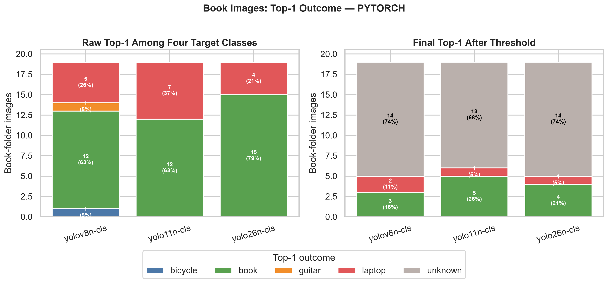
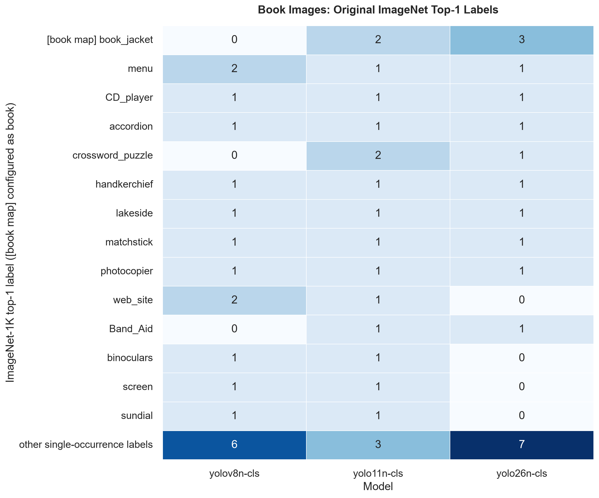

# 상품 분류 실험과 RTMDet-x 추론 API

실험 순서: YOLO nano zero-shot → RTMDet-tiny Top-K → RTMDet 모델 크기별 Top-K → RTMDet-x Top-1 API. 각 실험은 추가 학습 없이 사전학습 모델을 평가했습니다. YOLO와 RTMDet는 평가 이미지 수와 라벨 구성이 달라 수치를 직접 비교하지 않습니다.

## 1. YOLO nano zero-shot 비교 실험

Google Drive에 있는 이미지에 별도 학습이나 fine-tuning을 수행하지 않고,
ImageNet-1K 사전학습 분류 모델인 `YOLOv8n-cls`, `YOLO11n-cls`,
`YOLO26n-cls`를 zero-shot transfer 방식으로 비교합니다. 여기서 zero-shot은
추가 학습이 없다는 뜻이며, 임의의 텍스트 클래스를 이해하는 CLIP식
open-vocabulary 모델이라는 뜻은 아닙니다.

### 데이터 구조

라벨 파일 대신 상위 카테고리 폴더명을 정답으로 사용합니다. 현재 보고서에 사용된
중복 제거 및 이미지 검증 후 평가 데이터는 다음과 같습니다.

```text
평가 이미지 292장
├─ bicycle    31장
├─ book       19장
├─ guitar     42장
└─ laptop    200장
```

Drive의 정식 폴더명은 `bicycle`입니다. 과거 폴더명인 `bycicle`도 호환을 위해
`bicycle`로 자동 정규화합니다. `open_image`와 `public`은 라벨로 사용하지 않으며
이미지는 재귀적으로 검색합니다. 파일 내용 SHA-256으로 중복을 제거하고 손상된
이미지는 제외하지만, 이미지 복사나 train/val/test split은 생성하지 않습니다.

### zero-shot 판정 방식

세 `-cls` 체크포인트는 ImageNet-1K 확률을 출력합니다. 목표 클래스마다 관련
ImageNet 클래스 확률을 합산하되 네 클래스 안에서 다시 정규화하지 않습니다.
각 클래스의 원래 점수에 임계값을 적용한 뒤, 점수 순위가 설정된 `top_k` 안에 드는
라벨만 승인합니다. 현재 `top_k: 1`이므로 한 이미지에서는 최고 점수 라벨 하나만
승인되며, 그 점수도 해당 클래스 임계값을 넘지 못하면 `unknown`입니다.

매핑과 운영 임계값은 [config/inference.yaml](config/inference.yaml)의
`imagenet_class_patterns`, `verification_thresholds`에서 수정할 수 있습니다.
현재 다른 세 카테고리 이미지는 각 클래스 one-vs-rest 평가에서 negative sample로
사용됩니다. 실제 배포 전에는 관련 없는 일상 사진도 negative sample로 추가해
임계값을 다시 정하는 것이 좋습니다.

- bicycle: bicycle-built-for-two, mountain bike 계열
- book: book jacket, comic book
- guitar: acoustic guitar, electric guitar
- laptop: laptop, notebook computer

### 비교 지표

- `expected_label_accept_rate_macro`: 폴더명으로 확인된 주 객체의 승인율 평균
- `expected_label_reject_rate_macro`: 폴더명으로 확인된 주 객체의 거부율 평균
- `additional_label_activation_rate_macro`: 주 객체 외 라벨이 함께 승인된 비율. 한
  이미지에 여러 객체가 있을 수 있으므로 오탐률로 해석하지 않습니다.
- `multiple_label_rate`: 두 개 이상의 라벨이 동시에 승인된 이미지 비율
- `open_set_top1_accuracy`: 참고용으로, 최고 점수 하나를 고른 뒤 임계값 미달이면
  `unknown` 처리한 정확도
- `latency_mean_ms`, p50, p95, FPS: 파일 I/O와 warm-up을 제외한 batch=1
  전처리+forward+후처리 wall-clock 속도
- `model_size_mb`: 해당 backend가 실제 사용한 `.pt` 또는 `.onnx` 파일 크기(MiB)
- `core_inference_mean_ms`: Ultralytics가 보고하는 forward 시간
- `target_probability_mass_mean`: 네 목표 클래스에 배정된 원래 ImageNet 확률의 합
- confusion matrix와 이미지별 확률

폴더 레이블은 이미지에 존재하는 유일한 객체가 아니라 최소한 존재한다고 확인된
주 객체로 취급합니다. 따라서 기존 `accuracy`, `auc_macro_ovr`, confusion matrix는
단일 레이블 가정의 참고용 proxy이며, 실제 false accept rate로 해석하면 안 됩니다.
정확한 오탐률 측정에는 이미지마다 존재하는 모든 객체의 복수 정답 annotation이
필요합니다.

### 현재 YOLO 결과 보고서

#### 실험 조건

- 평가 이미지: 총 292장
- 모델: `YOLOv8n-cls`, `YOLO11n-cls`, `YOLO26n-cls`
- 입력 크기: 224×224
- 판정 임계값: 모든 클래스 0.05
- 승인 순위: top-k 1
- 실행 장치: Intel CPU, PyTorch 2.13.0 CPU
- Ultralytics: 8.4.128
- 학습 방식: 추가 학습 없는 ImageNet-1K zero-shot 매핑

현재 데이터는 laptop 200장, book 19장으로 클래스 불균형이 큽니다. 아래의
`macro` 지표는 각 클래스 비율을 동일하게 반영하지만, 전체 이미지 단위 지표는
laptop 결과의 영향을 크게 받습니다.

#### PyTorch 모델 종합 비교

| 모델 | 주 객체 승인율 | 주 객체 거부율 | 추가 라벨 활성화율 | 복수 라벨률 | unknown률 | Top-1 정확도 | 지연시간 | 모델 크기 |
|---|---:|---:|---:|---:|---:|---:|---:|---:|
| YOLOv8n-cls | 71.1% | 28.9% | 2.8% | 0.0% | 12.0% | 87.0% | 15.39 ms | 5.31 MiB |
| YOLO11n-cls | **73.8%** | **26.2%** | **1.3%** | 0.0% | 14.4% | 85.3% | 17.32 ms | 5.52 MiB |
| YOLO26n-cls | 71.2% | 28.8% | **1.3%** | 0.0% | 13.4% | 86.3% | 17.28 ms | 5.52 MiB |

주 객체 승인율 기준으로는 YOLO11n-cls가 가장 높고 추가 라벨 활성화도 낮습니다.
`top_k: 1` 정책에 따라 모든 모델의 복수 라벨률은 0%입니다. YOLOv8n-cls는 가장
빠르고 작으며 laptop 승인율이 가장 높습니다.
그러나 세 모델의 전체 승인율 차이는 약 2.6%p에 불과하고, 아래에서 확인되는
book 성능 차이가 모델 선택에 더 중요한 요소입니다.


#### 클래스별 승인율

| 모델 | 자전거 | 책 | 기타 | 노트북 |
|---|---:|---:|---:|---:|
| YOLOv8n-cls | 87.1% (27/31) | 15.8% (3/19) | 88.1% (37/42) | **93.5% (187/200)** |
| YOLO11n-cls | **87.1% (27/31)** | **26.3% (5/19)** | **92.9% (39/42)** | 89.0% (178/200) |
| YOLO26n-cls | 80.6% (25/31) | 21.1% (4/19) | 90.5% (38/42) | 92.5% (185/200) |

자전거·기타·노트북은 대체로 80.6~94.0%의 승인율을 보이지만, 책은
15.8~26.3%에 그칩니다. 따라서 현재 모델을 네 클래스 인증 기능에 그대로
사용하면 책 사용자는 실제 책을 보여줘도 약 74~84% 확률로 재촬영을 요구받을 수
있습니다.

오른쪽 heatmap의 추가 라벨 활성화는 확정 오탐이 아닙니다. 폴더 레이블 외의
객체가 실제 이미지 안에 함께 존재할 수 있기 때문입니다.


#### 책 이미지의 top-1 결과

아래 왼쪽 그래프는 임계값을 적용하기 전에 네 목표 클래스 중 점수가 가장 높았던
라벨이고, 오른쪽 그래프는 `top_k: 1`과 클래스 임계값 0.05를 모두 적용한 최종
결과입니다.

| 모델 | 임계값 전 book 1위 | 임계값 후 book 승인 | 다른 클래스 승인 | unknown |
|---|---:|---:|---:|---:|
| YOLOv8n-cls | 12/19 (63%) | 3/19 (16%) | 2/19 laptop | 14/19 (74%) |
| YOLO11n-cls | 12/19 (63%) | 5/19 (26%) | 1/19 laptop | 13/19 (68%) |
| YOLO26n-cls | 15/19 (79%) | 4/19 (21%) | 1/19 laptop | 14/19 (74%) |

YOLOv8n의 임계값 전 나머지 결과는 laptop 5장, guitar 1장, bicycle 1장이고,
YOLO11n은 laptop 7장, YOLO26n은 laptop 4장입니다. 세 모델 모두 book이 원점수
1위인 이미지는 최종 승인 수보다 훨씬 많습니다. 따라서 book 성능 저하의 핵심은
다른 세 클래스보다 순위가 낮아서라기보다 book 절대 점수가 0.05를 넘지 못해
unknown으로 거부되는 현상입니다.



#### 책 이미지의 원본 ImageNet-1K 예측 라벨

앞의 top-1 그래프는 네 목표 클래스의 합산 점수만 비교합니다. 실제 ImageNet-1K
전체 1,000개 클래스 중 원본 top-1을 확인하면 모델이 책 이미지를 어떤 시각적
개념으로 해석했는지 더 직접적으로 볼 수 있습니다.

| 모델 | `book_jacket` top-1 | `comic_book` top-1 | 대표적인 다른 top-1 라벨 |
|---|---:|---:|---|
| YOLOv8n-cls | 0/19 | 0/19 | menu 2, web_site 2, bookcase 1, screen 1 |
| YOLO11n-cls | 2/19 | 0/19 | crossword_puzzle 2, menu 1, shield 1, screen 1 |
| YOLO26n-cls | 3/19 | 0/19 | crossword_puzzle 1, bookshop 1, menu 1, vestment 1 |

세 모델에서 현재 book으로 매핑된 원본 클래스가 top-1인 경우는 총 5/57회뿐이고,
`comic_book`은 한 번도 top-1이 아닙니다. 반복적으로 등장하는 `menu`,
`crossword_puzzle`, `web_site`, `screen`은 펼친 페이지나 인쇄물의 레이아웃을,
`CD_player`, `accordion`, `matchstick`, `photocopier` 등은 책의 직사각형 외형,
페이지 선 또는 주변 장면을 잘못 해석한 결과로 볼 수 있습니다.

`bookcase`, `bookshop`, `crossword_puzzle`처럼 책과 관련된 ImageNet 클래스도 일부
나오지만 이를 모두 book 매핑에 추가하는 것은 안전하지 않습니다. 책장이나 서점
사진, 퍼즐 화면만으로도 인증이 통과할 수 있기 때문입니다. 이 결과는 패턴을
무작정 확장하기보다 실제 책 형태를 학습한 모델이 필요하다는 근거입니다.



각 이미지와 모델의 원본 ImageNet top-5 라벨 및 확률은
[상세 CSV](docs/reports/yolo_book_imagenet_top5.csv)에서 확인할 수 있습니다. 다음
명령으로 현재 이미지에 대한 분석 결과를 다시 생성할 수 있습니다.

```powershell
python scripts\analyze_book_imagenet_labels.py --top-k 5 --device cpu
```

#### 책 성능 저하 분석

책 성능이 낮은 주된 원인은 모델 크기보다 현재 zero-shot 매핑과 실제 이미지의
차이입니다.

1. ImageNet에서 book 점수로 사용하는 클래스가 `book jacket`과 `comic book`
   두 개뿐입니다. 표지가 정면으로 보이는 책에는 반응하지만 펼친 책, 책 더미,
   독서 장면을 일반적인 book으로 표현하지 못합니다.
2. 현재 분류 전처리는 짧은 변을 224로 맞춘 뒤 중앙 224×224를 잘라냅니다. 책이
   가장자리에 있거나 세로 사진 하단에 있으면 일부가 제거됩니다.
3. 전체 이미지 분류 모델이므로 책보다 사람, 바다, 컵, 담요, 노트북 같은 배경이
   더 강하면 배경 객체를 대표 클래스로 선택합니다.
4. 책 데이터가 19장뿐이고 그중 Pinterest 계열 8장은 세 모델 모두 현재 임계값에서
   한 장도 승인하지 못했습니다.

YOLO11n-cls에 한해 중앙 crop 대신 전체 화면 letterbox 입력을 시험했을 때 책
승인 수는 5/19에서 7/19로 증가했고 book 점수 중앙값은 0.00343에서 0.00527로
상승했습니다. 이미지 잘림이 일부 영향을 주는 것은 확인됐지만, 12/19는 여전히
거부되어 crop만으로는 해결되지 않습니다.

임계값을 낮추면 책 승인율은 올라가지만 다른 폴더 이미지의 book 활성화도 함께
증가합니다. 다음 값은 YOLO11n-cls의 참고용 민감도 분석이며, 다른 폴더에도 실제
책이 존재할 수 있으므로 마지막 열을 확정 오탐률로 해석하면 안 됩니다.

| book 임계값 | 책 승인 | 다른 폴더의 book 활성화 |
|---:|---:|---:|
| 0.050 | 5/19 (26.3%) | 0/273 (0.0%) |
| 0.010 | 7/19 (36.8%) | 1/273 (0.4%) |
| 0.001 | 11/19 (57.9%) | 1/273 (0.4%) |

book ROC-AUC는 모델별로 0.863~0.937이므로 책 이미지가 상대적으로 높은 점수를
받는 경향 자체는 있습니다. 문제는 실제 운영 임계값을 넘을 만큼 절대 점수가
높지 않다는 점입니다. 임계값만 크게 내리기보다는 실제 앱 카메라 환경의 책
데이터와 unknown 데이터를 추가하고, 광범위한 책 표현을 학습한 embedding 또는
객체 탐지 모델로 교체한 뒤 임계값을 다시 보정해야 합니다.

#### PyTorch와 ONNX 비교

두 backend의 클래스 점수와 승인 결과는 사실상 동일합니다. 따라서 ONNX 변환으로
정확도가 떨어진 현상은 관찰되지 않았습니다. 반면 CPU wall-clock 속도는 모델마다
차이가 일정하지 않았습니다.

| 모델 | PyTorch 지연시간 | ONNX 지연시간 | PyTorch 크기 | ONNX 크기 |
|---|---:|---:|---:|---:|
| YOLOv8n-cls | 15.39 ms | 39.76 ms | 5.31 MiB | 10.39 MiB |
| YOLO11n-cls | 17.32 ms | **15.45 ms** | 5.52 MiB | 10.77 MiB |
| YOLO26n-cls | **17.28 ms** | 19.22 ms | 5.52 MiB | 10.77 MiB |

YOLOv8n ONNX는 p50이 11.97 ms인 반면 평균 39.76 ms, p95 263.28 ms로 큰 지연
스파이크가 있었습니다. 이 결과만으로 ONNX가 느리다고 일반화할 수 없으며, 모바일
배포 판단에는 실제 Android NNAPI 또는 iOS Core ML 환경에서 별도 측정이 필요합니다.


#### 현재 결론

- 전체 평균과 속도의 균형은 YOLO11n-cls가 가장 낫습니다.
- 속도와 파일 크기를 우선하면 YOLOv8n-cls가 유리합니다.
- 하지만 세 모델 모두 book 승인율이 낮아 현재 상태로 최종 모델을 확정하기 어렵습니다.
- 현재 폴더 레이블은 비배타적이므로 추가 라벨 활성화를 곧바로 오탐으로 계산하면 안 됩니다.
- 현재 앱 판정은 top-1 라벨만 승인하며, 최고 점수도 클래스 임계값을 넘지 못하면
  unknown으로 처리합니다. 이미지 품질 조건과 연속 프레임 확인은 별도로 필요합니다.
- 다음 실험은 전체 화면 전처리와 embedding 기반 4-class multi-label head를 우선
  비교하고, 모든 객체에 대한 복수 정답 및 unknown 데이터를 확보하는 방향이 적절합니다.

### 로컬 실행

Google Drive for desktop으로 Drive를 mount한 뒤 PowerShell에서 실행합니다.

```powershell
cd C:\Users\jgi01\Desktop\side_project
.\.venv\Scripts\Activate.ps1
uv pip install -r requirements.txt

python scripts\run_inference.py --config config\inference.yaml --backend both
```

기본 Drive 경로는 [config/inference.yaml](config/inference.yaml)의 `raw_dir`에
설정되어 있습니다.

```yaml
drive_folder_url: 'https://drive.google.com/drive/folders/18mUVx75GlJyRX6vUnw4zDWEWwwrPR8Fg?usp=sharing'
raw_dir: 'G:/My Drive/side_project/sample'
```

`drive_folder_url`은 폴더 확인을 위한 참고값입니다. 브라우저 URL은 로컬 파일
경로가 아니므로 Ultralytics가 직접 읽을 수 없습니다. `raw_dir`에는 Google
Drive for desktop이 만든 실제 경로를 지정해야 합니다. 드라이브 문자나
`My Drive`/`내 드라이브` 이름이 다르면 실행기가 Windows 드라이브에서
`side_project/sample`을 자동 탐색합니다.

Drive 문자나 폴더명이 다르면 이 값만 수정합니다. YAML에서는 Windows 경로도
역슬래시(`\`)보다 슬래시(`/`) 표기를 권장합니다. `--source`를 지정하면 YAML
기본값을 일시적으로 덮어쓸 수 있습니다.

backend, GPU 또는 한 모델만 빠르게 확인:

```powershell
python scripts\run_inference.py --backend pytorch
python scripts\run_inference.py --backend onnx
python scripts\run_inference.py --source "G:\내 드라이브\side_project\sample" --device 0
python scripts\run_inference.py --models yolov8n-cls.pt --backend both
```

모델 가중치는 최초 실행 시 Ultralytics가 다운로드합니다. Drive 원본은 읽기만
하며 로컬 `data/processed`나 Drive 내부에 이미지 사본을 만들지 않습니다.
단, Drive for desktop 스트리밍 캐시와 추론용 RAM/VRAM은 사용됩니다.
이미지 검증, 모델별 inference, 반복 속도 측정은 `tqdm` 진행률과 ETA를 실시간으로
표시합니다.

`scoring (not speed metric)`의 `image/s`는 Drive 파일 접근과 결과 생성이 포함된
진행 상황 표시이므로 backend 속도 지표로 사용하지 않습니다. 속도 비교에는 두
backend 모두 batch=1, 파일 디코딩 제외, warm-up 적용 조건으로 별도 수행되는
`speed test`의 `latency_mean_ms`를 사용합니다.

사전학습 `.pt` 체크포인트와 최초 ONNX 실행 때 export되는 `.onnx` 파일은
`inference.yaml`의 `model_dir`에 따라 `models/weights`에 저장됩니다. ONNX
단순화 여부는 `onnx.simplify`로 설정합니다.

### 결과

```text
outputs/benchmark/
├─ pytorch/
│  ├─ summary.csv
│  ├─ summary.json
│  ├─ comparison.png
│  ├─ verification_by_class.png
│  ├─ book_top1_outcomes.png
│  ├─ book_imagenet_top1_labels.png
│  ├─ book_imagenet_topk.csv
│  ├─ yolov8n-cls/predictions.csv
│  ├─ yolo11n-cls/...
│  └─ yolo26n-cls/...
└─ onnx/
   ├─ summary.csv
   ├─ summary.json
   ├─ comparison.png
   ├─ verification_by_class.png
   ├─ book_top1_outcomes.png
   ├─ yolov8n-cls/predictions.csv
   ├─ yolo11n-cls/...
   └─ yolo26n-cls/...
```

각 backend의 `comparison.png`는 주 객체 승인/거부, 추가 라벨 및 복수 라벨 활성화,
추론시간, 모델 크기로 세 YOLO 모델을 비교하는 2×3 그래프입니다.
`verification_by_class.png`는 책·자전거·기타·노트북별 주 객체 승인율과 추가 라벨
활성화율 heatmap입니다. `book_top1_outcomes.png`는 book 이미지의 임계값 전 원점수
1위와 top-k 및 임계값 적용 후 결과를 비교합니다. 종합 지표는 `summary.csv`와
`summary.json`에, top-1 세부 분포는 `summary.json`과 모델별 `metrics.json`에
기록됩니다. PyTorch의 `book_imagenet_top1_labels.png`와
`book_imagenet_topk.csv`는 원본 ImageNet-1K 라벨 진단 결과입니다.
기존 추론 결과는 `python scripts/regenerate_reports.py`로 재추론 없이 새 그래프로
다시 만들 수 있습니다. 각 실행의
`metrics.json`에는 실제 매칭된 ImageNet 클래스명, 임계값, 클래스별 이미지 수,
confusion matrix, 라이브러리 및 장치 정보도 기록됩니다. `predictions.csv`에는
클래스별 원점수와 독립 판정(`accepted_*`)이 포함됩니다.

## 2. RTMDet-tiny Top-1·Top-2 실험

2026-09-22에 데이터를 갱신하고 COCO 사전학습 RTMDet-tiny를 평가했습니다. 원본 451장 중 완전 중복 79장을 제외한 372장(`computer` 200, `book` 71, `other` 101)을 사용했습니다. `computer`는 COCO `laptop`·`tv`, `book`은 COCO `book` 탐지에 대응하며 나머지는 `other`입니다. 입력 640, 탐지 confidence 0.01, NMS IoU 0.6, 그룹 수락 임계값 0.05로 판정했습니다. Top-1과 Top-2는 같은 탐지 결과에서 계산했습니다.

| 정답 그룹 | 이미지 수 | Top-1 정확도 | Top-2 정답 포함률 |
|---|---:|---:|---:|
| 전체 | 372 | 87.63% (326/372) | 98.39% (366/372) |
| computer | 200 | 89.00% | 97.50% |
| book | 71 | 67.61% | 98.59% |
| other | 101 | 99.01% | 100.00% |

Top-2는 정답을 40장 더 후보에 넣지만 단일 분류 정확도가 아닙니다. 다음 표의 Accuracy는 해당 카테고리의 양성·음성을 합친 이진 정확도입니다. FPR은 다른 카테고리가 후보로 잘못 포함된 비율이고 FNR은 실제 카테고리가 빠진 비율(`100% − Recall`)입니다.

| 카테고리 | Top-K | Accuracy | Precision | Recall | FPR | FNR |
|---|---:|---:|---:|---:|---:|---:|
| computer | Top-1 | 93.28% | 98.34% | 89.00% | 1.74% | 11.00% |
| computer | Top-2 | 93.28% | 90.70% | 97.50% | 11.63% | 2.50% |
| book | Top-1 | 93.55% | 97.96% | 67.61% | 0.33% | 32.39% |
| book | Top-2 | 80.38% | 49.30% | 98.59% | 23.92% | 1.41% |

Top-2에서 전체 정답 포함률은 올랐지만 `book`의 이진 Accuracy는 93.55%에서 80.38%로 내려갔습니다. 참양성은 48장에서 70장으로 늘었지만 거짓양성도 1장에서 72장으로 늘었기 때문입니다. [Top-K 실험 보고서](https://github.com/jgi0117/side_project_product_classification/blob/experiment/rtmdet-topk/docs/rtmdet-topk/drive-20260922/README.md)에 상세 결과가 있습니다.

## 3. RTMDet 모델 크기별 Top-1·Top-2 실험

COCO 사전학습 RTMDet의 크기(tiny, s, m, l, x)에 따라 이 프로젝트의 `computer`·`book`·`other` 이미지 판정과 추론 시간이 어떻게 달라지는지 비교했습니다. 한 번 저장한 모델별 탐지 결과에서 Top-1과 Top-2를 모두 계산했습니다. **모델을 추가 학습하거나 fine-tuning한 실험은 아닙니다.**

### 실험 조건

- 평가 이미지: 폴더 라벨 기준 고유 이미지 **372장** (`computer` 200, `book` 71, `other` 101). 원본 451장 중 완전 중복 79장을 제외했습니다. 위 RTMDet-tiny Top-K 실험과 이미지 SHA-256 목록이 같습니다.
- 라벨 매핑: `computer` = COCO `laptop`·`tv`, `book` = COCO `book`, 나머지 폴더 = `other`.
- 공통 설정: 입력 640, 탐지 confidence 0.01, NMS IoU 0.6, 그룹 수락 임계값 0.05. 전체 실행(`smoke_test=false`)에서 다섯 모델 모두 완료했습니다.
- 속도: CPU, 배치 1, 워밍업 5회 후 이미지당 3회 측정한 평균. 디스크 입출력은 제외했습니다. 용량은 체크포인트 파일 크기입니다.

### 전체 결과

| 모델 | Top-1 정확도 | Top-2 정답 포함률 | Top-2 추가 포함 | 평균 지연 (ms/장) | 체크포인트 (MiB) |
|---|---:|---:|---:|---:|---:|
| tiny | 87.63% (326/372) | 98.39% (366/372) | 40장 | 176.00 | 54.87 |
| s | 90.59% (337/372) | 98.66% (367/372) | 30장 | 251.68 | 87.21 |
| m | 93.01% (346/372) | **99.46% (370/372)** | 24장 | 481.06 | 213.91 |
| l | 92.47% (344/372) | 98.66% (367/372) | 23장 | 835.89 | 432.74 |
| x | **94.09% (350/372)** | 99.19% (369/372) | 19장 | 1346.65 | 377.26 |

Top-1은 단일 예측의 정확도입니다. Top-2는 최대 두 후보 중 정답이 있는 비율이며 단일 분류 정확도와 같은 지표가 아닙니다. Top-2의 추가 포함은 같은 모델의 Top-1보다 정답을 더 포함한 이미지 수입니다.

### 결과 분석

**크기가 커질수록 성능이 항상 오르지는 않았습니다.** x의 Top-1은 가장 높지만, l은 m보다 정확도가 0.54%p 낮고 이미지당 처리 시간은 약 1.74배 길었습니다. tiny에서 x로 바꾸면 Top-1 정답이 24장 늘어나는 대신 CPU 처리 시간은 약 7.65배가 됩니다.

**m과 x의 선택은 지표에 따라 달라집니다.** x는 m보다 Top-1에서 4장 더 맞혔습니다(94.09% 대 93.01%). 같은 이미지에 대한 정오를 대조하면 둘 다 맞힌 이미지가 339장, m만 맞힌 이미지가 7장, x만 맞힌 이미지가 11장입니다. x가 m의 정답을 모두 포함하는 관계는 아닙니다. m은 x보다 약 2.80배 빠르고 체크포인트 파일이 약 43% 작습니다.

**Top-2에서는 m의 정답 포함률이 가장 높지만 오탐도 봐야 합니다.** m은 370장, x는 369장의 정답을 후보 안에 넣었습니다. 두 모델 모두 정답을 포함한 이미지는 368장이고, m만 포함한 이미지는 2장, x만 포함한 이미지는 1장입니다. 반면 Top-2에서 x의 `computer` FPR은 8.14%로 m의 13.37%보다 낮고, `book` FPR도 14.62%로 m의 17.94%보다 낮습니다. 후보를 실제 수락으로 처리한다면 이 차이가 중요합니다.

**book에서 놓치는 이미지도 줄었습니다.** x의 Top-1 `book` FNR은 14.08%(10/71)로 m의 21.13%(15/71)보다 낮습니다. Top-2에서 x는 71장 모두를 후보에 넣어 FNR이 0%가 되지만, `book` 정밀도는 61.74%이고 FPR은 14.62%입니다. 놓치는 비율과 오탐 비율을 함께 해석해야 합니다.

#### 카테고리별 Top-K 비교

각 모델에서 카테고리별 Top-1과 Top-2를 별도 행으로 비교합니다. Accuracy는 해당 카테고리의 양성·음성을 합친 이진 판정 정확도입니다. FPR은 다른 카테고리가 후보로 잘못 포함된 비율이고, FNR은 실제 해당 카테고리가 후보에서 빠진 비율(`100% − Recall`)입니다.

##### RTMDet-tiny

| 카테고리 | Top-K | Accuracy | Precision | Recall | FPR | FNR |
|---|---:|---:|---:|---:|---:|---:|
| computer | Top-1 | 93.28% | 98.34% | 89.00% | 1.74% | 11.00% |
| computer | Top-2 | 93.28% | 90.70% | 97.50% | 11.63% | 2.50% |
| book | Top-1 | 93.55% | 97.96% | 67.61% | 0.33% | 32.39% |
| book | Top-2 | 80.38% | 49.30% | 98.59% | 23.92% | 1.41% |

##### RTMDet-s

| 카테고리 | Top-K | Accuracy | Precision | Recall | FPR | FNR |
|---|---:|---:|---:|---:|---:|---:|
| computer | Top-1 | 94.89% | 98.92% | 91.50% | 1.16% | 8.50% |
| computer | Top-2 | 91.67% | 87.89% | 98.00% | 15.70% | 2.00% |
| book | Top-1 | 95.70% | 100.00% | 77.46% | 0.00% | 22.54% |
| book | Top-2 | 83.33% | 53.44% | 98.59% | 20.27% | 1.41% |

##### RTMDet-m

| 카테고리 | Top-K | Accuracy | Precision | Recall | FPR | FNR |
|---|---:|---:|---:|---:|---:|---:|
| computer | Top-1 | 97.04% | 100.00% | 94.50% | 0.00% | 5.50% |
| computer | Top-2 | 93.55% | 89.64% | 99.50% | 13.37% | 0.50% |
| book | Top-1 | 95.97% | 100.00% | 78.87% | 0.00% | 21.13% |
| book | Top-2 | 85.22% | 56.45% | 98.59% | 17.94% | 1.41% |

##### RTMDet-l

| 카테고리 | Top-K | Accuracy | Precision | Recall | FPR | FNR |
|---|---:|---:|---:|---:|---:|---:|
| computer | Top-1 | 96.77% | 99.47% | 94.50% | 0.58% | 5.50% |
| computer | Top-2 | 93.82% | 90.41% | 99.00% | 12.21% | 1.00% |
| book | Top-1 | 95.70% | 100.00% | 77.46% | 0.00% | 22.54% |
| book | Top-2 | 84.41% | 55.20% | 97.18% | 18.60% | 2.82% |

##### RTMDet-x

| 카테고리 | Top-K | Accuracy | Precision | Recall | FPR | FNR |
|---|---:|---:|---:|---:|---:|---:|
| computer | Top-1 | 97.04% | 100.00% | 94.50% | 0.00% | 5.50% |
| computer | Top-2 | 95.43% | 93.36% | 98.50% | 8.14% | 1.50% |
| book | Top-1 | 97.04% | 98.39% | 85.92% | 0.33% | 14.08% |
| book | Top-2 | 88.17% | 61.74% | 100.00% | 14.62% | 0.00% |

이번 스프린트에는 단일 예측 정확도가 가장 높은 **RTMDet-x Top-1**을 선택했습니다. `book` Top-1 FNR도 x가 14.08%(10/71)로 m의 21.13%(15/71)보다 낮습니다. CPU 지연은 m보다 약 2.80배이므로 운영 환경의 지연 시간은 별도로 측정해야 합니다.

폴더별 주 라벨 하나로 평가했으므로 사진에 대상이 여러 개면 FPR이 과대 집계될 수 있습니다. 이 결과는 이미지 수준 비교이며 객체 탐지 mAP나 실제 서비스 오류율이 아닙니다. [크기별 실험 보고서](https://github.com/jgi0117/side_project_product_classification/blob/experiment/rtmdet-model-size/docs/rtmdet-model-size/model-size-20260927/README.md) · [집계 CSV](https://github.com/jgi0117/side_project_product_classification/blob/experiment/rtmdet-model-size/docs/rtmdet-model-size/model-size-20260927/comparison.csv) · [설정·가중치 해시](https://github.com/jgi0117/side_project_product_classification/blob/experiment/rtmdet-model-size/docs/rtmdet-model-size/model-size-20260927/comparison.json)

## 4. RTMDet-x Top-1 FastAPI

이번 스프린트의 추론 모델은 **COCO 사전학습 RTMDet-x**이며, 결과는 `computer`, `book`, `other` 중 하나입니다. 실험에서 사용한 입력 640, 탐지 confidence 0.01, NMS IoU 0.6, 그룹 임계값 0.05와 동일한 판정 로직을 사용합니다. 모델은 서버 시작 시 한 번만 로드하고 요청마다 재사용합니다.

### 준비와 실행

저장소 루트에서 Python 3.11 RTMDet 환경을 사용합니다. 기존 `.model_envs/rtmdet` 환경에는 PyTorch, MMCV, MMDetection이 설치돼 있습니다. 새 환경을 구성한다면 [RTMDet 의존성](requirements-rtmdet.txt)을 참고하고, PyTorch 버전에 맞는 MMCV wheel을 설치하세요. API 패키지는 다음 명령으로 설치합니다.

```powershell
uv pip install --python .model_envs/rtmdet/Scripts/python.exe -r requirements-api.txt
```

체크포인트는 Git에 포함되지 않습니다. `models/pretrained/rtmdet_x.pth`가 없다면 공식 파일을 받으세요. 서버는 시작할 때 이 파일의 SHA-256을 확인합니다.

```powershell
New-Item -ItemType Directory -Force models/pretrained | Out-Null
curl.exe --fail --location --retry 3 --output models/pretrained/rtmdet_x.pth https://download.openmmlab.com/mmdetection/v3.0/rtmdet/rtmdet_x_8xb32-300e_coco/rtmdet_x_8xb32-300e_coco_20220715_230555-cc79b9ae.pth
$env:RTMDET_DEVICE = 'cpu'
$env:RTMDET_API_KEY = 'replace-with-a-shared-secret'
.model_envs/rtmdet/Scripts/python.exe -m uvicorn yolo_benchmark.rtmdet_api:app --app-dir src --host 0.0.0.0 --port 8000 --workers 1
```

`RTMDET_DEVICE`는 CUDA 사용 시 `cuda:0`으로 지정할 수 있습니다. `RTMDET_X_WEIGHTS`로 체크포인트 경로를 바꿀 수 있지만 동일한 RTMDet-x 체크포인트 SHA-256이어야 합니다. `RTMDET_API_KEY`를 설정하면 `/predict`에 `X-API-Key` 헤더가 필요합니다. 다른 머신의 백엔드는 이 서버의 접근 가능한 IP/도메인과 포트로 호출해야 합니다. `0.0.0.0` 바인딩은 네트워크 수신을 허용하지만 방화벽이나 배포 환경의 라우팅까지 설정하지는 않습니다.

### 요청과 응답

`POST /predict`는 `multipart/form-data`의 `file` 필드로 이미지 한 장을 받습니다. 디코딩 가능한 이미지 최대 10 MiB를 허용하며, 추론 후 원본 이미지를 영구 저장하지 않습니다.

```powershell
curl.exe -X POST http://SERVER_IP:8000/predict -H "X-API-Key: replace-with-a-shared-secret" -F "file=@C:/path/to/image.jpg"
```

응답 JSON에는 `model: "rtmdet-x"`, `top_k: 1`, `prediction`, `confidence`, `group_scores`, `decision_reason`이 있습니다. `prediction`은 `computer`·`book`·`other` 중 하나입니다. `confidence`는 선택된 그룹의 최고 탐지 점수이며 보정된 분류 확률은 아닙니다. 임계값을 통과한 탐지가 없으면 `other`로 반환하고 `decision_reason`은 `no_passing_detection`입니다.

백엔드 Python 호출 예시:

```python
import httpx

with open("image.jpg", "rb") as image:
    response = httpx.post(
        "http://SERVER_IP:8000/predict",
        headers={"X-API-Key": "replace-with-a-shared-secret"},
        files={"file": ("image.jpg", image, "image/jpeg")},
        timeout=30.0,
    )
response.raise_for_status()
prediction = response.json()["prediction"]
```

`GET /health`는 모델 로드가 끝난 서버에서 `{"status":"ok","model":"rtmdet-x","top_k":1}`을 반환합니다. 자동 생성 API 문서는 `/docs`에서 볼 수 있습니다. 잘못된 이미지에는 400, 키 오류에는 401, 10 MiB 초과에는 413, 파일 필드 누락에는 422를 반환합니다.

[별도 API 안내 문서](docs/rtmdet-x-api.md)에서도 같은 실행 방법을 확인할 수 있습니다.
