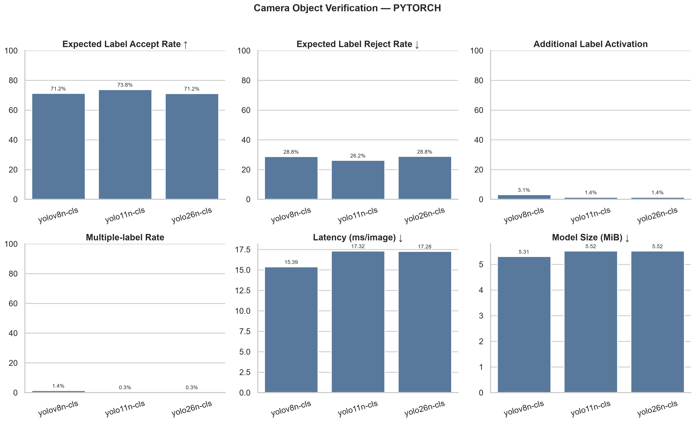
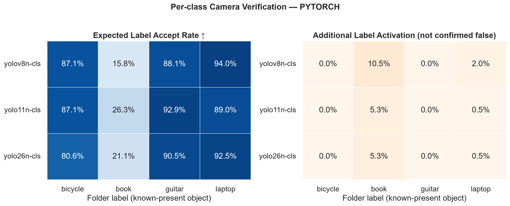
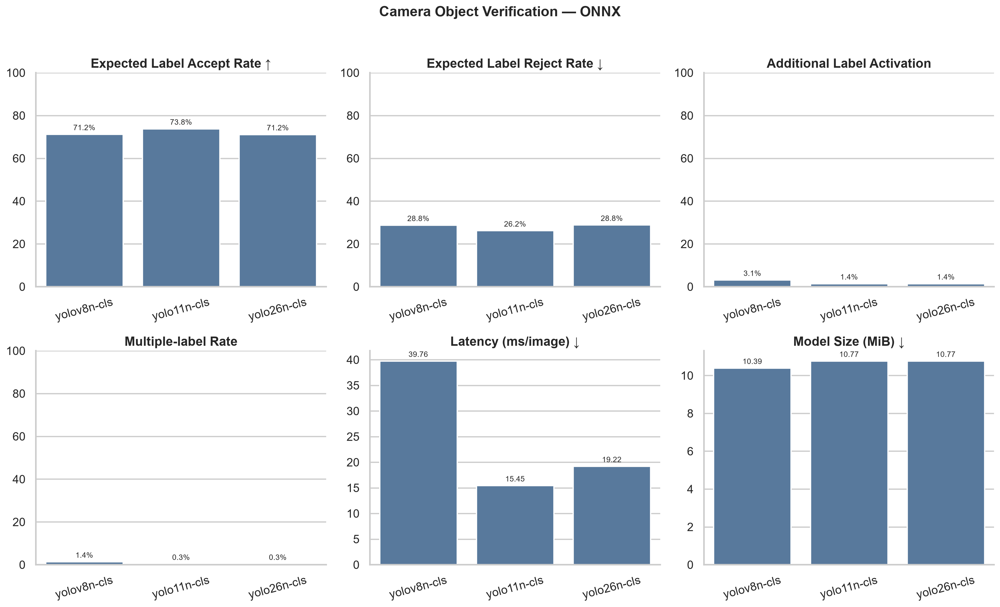

# YOLO nano zero-shot verification benchmark

Google Drive에 있는 이미지에 별도 학습이나 fine-tuning을 수행하지 않고,
ImageNet-1K 사전학습 분류 모델인 `YOLOv8n-cls`, `YOLO11n-cls`,
`YOLO26n-cls`를 zero-shot transfer 방식으로 비교합니다. 여기서 zero-shot은
추가 학습이 없다는 뜻이며, 임의의 텍스트 클래스를 이해하는 CLIP식
open-vocabulary 모델이라는 뜻은 아닙니다.

## 데이터 구조

라벨 파일 대신 상위 카테고리 폴더명을 정답으로 사용합니다. 현재 보고서에 사용된
중복 제거 및 이미지 검증 후 평가 데이터는 다음과 같습니다.

```text
평가 이미지 292장
├─ bicycle    31장
├─ book       19장
├─ guitar     42장
└─ laptop    200장
```

`open_image`와 `public`은 라벨로 사용하지 않으며 이미지는 재귀적으로 검색합니다. 파일 내용 SHA-256으로 중복을 제거하고 손상된 이미지는 제외하지만, 이미지 복사나 train/val/test split은 생성하지 않습니다.

## zero-shot 판정 방식

세 `-cls` 체크포인트는 ImageNet-1K 확률을 출력합니다. 목표 클래스마다 관련
ImageNet 클래스 확률을 합산하되 네 클래스 안에서 다시 정규화하지 않습니다.
각 클래스의 원래 점수가 `verification_thresholds`를 넘는지를 독립적으로
판정하며, 하나도 넘지 않으면 `unknown`입니다. 따라서 laptop 인증은 다른 세
클래스보다 laptop 점수가 큰지가 아니라 laptop 점수가 자체 임계값을 넘는지를
봅니다. 여러 클래스가 동시에 기준을 넘는 것도 기록합니다.

매핑과 운영 임계값은 [config/inference.yaml](config/inference.yaml)의
`imagenet_class_patterns`, `verification_thresholds`에서 수정할 수 있습니다.
현재 다른 세 카테고리 이미지는 각 클래스 one-vs-rest 평가에서 negative sample로
사용됩니다. 실제 배포 전에는 관련 없는 일상 사진도 negative sample로 추가해
임계값을 다시 정하는 것이 좋습니다.

- bicycle: bicycle-built-for-two, mountain bike 계열
- book: book jacket, comic book
- guitar: acoustic guitar, electric guitar
- laptop: laptop, notebook computer

## 비교 지표

- `expected_label_accept_rate_macro`: 폴더명으로 확인된 주 객체의 승인율 평균
- `expected_label_reject_rate_macro`: 폴더명으로 확인된 주 객체의 거부율 평균
- `additional_label_activation_rate_macro`: 주 객체 외 라벨이 함께 승인된 비율. 한
  이미지에 여러 객체가 있을 수 있으므로 오탐률로 해석하지 않습니다.
- `multiple_label_rate`: 두 개 이상의 라벨이 동시에 승인된 이미지 비율
- `open_set_top1_accuracy`: 참고용으로, 최고 점수 하나를 고른 뒤 임계값 미달이면
  `unknown` 처리한 정확도
- `latency_mean_ms`, p50, p95, FPS: 파일 I/O와 warm-up을 제외한 batch=1
  전처리+forward+후처리 wall-clock 속도
- `model_size_mb`: 해당 backend가 실제 사용한 `.pt` 또는 `.onnx` 파일 크기(MiB)
- `core_inference_mean_ms`: Ultralytics가 보고하는 forward 시간
- `target_probability_mass_mean`: 네 목표 클래스에 배정된 원래 ImageNet 확률의 합
- confusion matrix와 이미지별 확률

폴더 레이블은 이미지에 존재하는 유일한 객체가 아니라 최소한 존재한다고 확인된
주 객체로 취급합니다. 따라서 기존 `accuracy`, `auc_macro_ovr`, confusion matrix는
단일 레이블 가정의 참고용 proxy이며, 실제 false accept rate로 해석하면 안 됩니다.
정확한 오탐률 측정에는 이미지마다 존재하는 모든 객체의 복수 정답 annotation이
필요합니다.

## 현재 YOLO 결과 보고서

### 실험 조건

- 평가 이미지: 총 292장
- 모델: `YOLOv8n-cls`, `YOLO11n-cls`, `YOLO26n-cls`
- 입력 크기: 224×224
- 판정 임계값: 모든 클래스 0.05
- 실행 장치: Intel CPU, PyTorch 2.13.0 CPU
- Ultralytics: 8.4.128
- 학습 방식: 추가 학습 없는 ImageNet-1K zero-shot 매핑

현재 데이터는 laptop 200장, book 19장으로 클래스 불균형이 큽니다. 아래의
`macro` 지표는 각 클래스 비율을 동일하게 반영하지만, 전체 이미지 단위 지표는
laptop 결과의 영향을 크게 받습니다.

### PyTorch 모델 종합 비교

| 모델 | 주 객체 승인율 | 주 객체 거부율 | 추가 라벨 활성화율 | 복수 라벨률 | unknown률 | Top-1 정확도 | 지연시간 | 모델 크기 |
|---|---:|---:|---:|---:|---:|---:|---:|---:|
| YOLOv8n-cls | 71.2% | 28.8% | 3.1% | 1.4% | 12.0% | 87.0% | 15.39 ms | 5.31 MiB |
| YOLO11n-cls | **73.8%** | **26.2%** | **1.4%** | **0.3%** | 14.4% | 85.3% | 17.32 ms | 5.52 MiB |
| YOLO26n-cls | 71.2% | 28.8% | **1.4%** | **0.3%** | 13.4% | 86.3% | 17.28 ms | 5.52 MiB |

주 객체 승인율 기준으로는 YOLO11n-cls가 가장 높고 추가·복수 라벨 활성화도
낮습니다. YOLOv8n-cls는 가장 빠르고 작으며 laptop 승인율이 가장 높습니다.
그러나 세 모델의 전체 승인율 차이는 약 2.6%p에 불과하고, 아래에서 확인되는
book 성능 차이가 모델 선택에 더 중요한 요소입니다.



### 클래스별 승인율

| 모델 | 자전거 | 책 | 기타 | 노트북 |
|---|---:|---:|---:|---:|
| YOLOv8n-cls | 87.1% (27/31) | 15.8% (3/19) | 88.1% (37/42) | **94.0% (188/200)** |
| YOLO11n-cls | **87.1% (27/31)** | **26.3% (5/19)** | **92.9% (39/42)** | 89.0% (178/200) |
| YOLO26n-cls | 80.6% (25/31) | 21.1% (4/19) | 90.5% (38/42) | 92.5% (185/200) |

자전거·기타·노트북은 대체로 80.6~94.0%의 승인율을 보이지만, 책은
15.8~26.3%에 그칩니다. 따라서 현재 모델을 네 클래스 인증 기능에 그대로
사용하면 책 사용자는 실제 책을 보여줘도 약 74~84% 확률로 재촬영을 요구받을 수
있습니다.

오른쪽 heatmap의 추가 라벨 활성화는 확정 오탐이 아닙니다. 폴더 레이블 외의
객체가 실제 이미지 안에 함께 존재할 수 있기 때문입니다.



### 책 성능 저하 분석

책 성능이 낮은 주된 원인은 모델 크기보다 현재 zero-shot 매핑과 실제 이미지의
차이입니다.

1. ImageNet에서 book 점수로 사용하는 클래스가 `book jacket`과 `comic book`
   두 개뿐입니다. 표지가 정면으로 보이는 책에는 반응하지만 펼친 책, 책 더미,
   독서 장면을 일반적인 book으로 표현하지 못합니다.
2. 현재 분류 전처리는 짧은 변을 224로 맞춘 뒤 중앙 224×224를 잘라냅니다. 책이
   가장자리에 있거나 세로 사진 하단에 있으면 일부가 제거됩니다.
3. 전체 이미지 분류 모델이므로 책보다 사람, 바다, 컵, 담요, 노트북 같은 배경이
   더 강하면 배경 객체를 대표 클래스로 선택합니다.
4. 책 데이터가 19장뿐이고 그중 Pinterest 계열 8장은 세 모델 모두 현재 임계값에서
   한 장도 승인하지 못했습니다.

YOLO11n-cls에 한해 중앙 crop 대신 전체 화면 letterbox 입력을 시험했을 때 책
승인 수는 5/19에서 7/19로 증가했고 book 점수 중앙값은 0.00343에서 0.00527로
상승했습니다. 이미지 잘림이 일부 영향을 주는 것은 확인됐지만, 12/19는 여전히
거부되어 crop만으로는 해결되지 않습니다.

임계값을 낮추면 책 승인율은 올라가지만 다른 폴더 이미지의 book 활성화도 함께
증가합니다. 다음 값은 YOLO11n-cls의 참고용 민감도 분석이며, 다른 폴더에도 실제
책이 존재할 수 있으므로 마지막 열을 확정 오탐률로 해석하면 안 됩니다.

| book 임계값 | 책 승인 | 다른 폴더의 book 활성화 |
|---:|---:|---:|
| 0.050 | 5/19 (26.3%) | 0/273 (0.0%) |
| 0.010 | 8/19 (42.1%) | 7/273 (2.6%) |
| 0.001 | 13/19 (68.4%) | 34/273 (12.5%) |

book ROC-AUC는 모델별로 0.863~0.937이므로 책 이미지가 상대적으로 높은 점수를
받는 경향 자체는 있습니다. 문제는 실제 운영 임계값을 넘을 만큼 절대 점수가
높지 않다는 점입니다. 임계값만 크게 내리기보다는 실제 앱 카메라 환경의 책
데이터와 unknown 데이터를 추가하고, 광범위한 책 표현을 학습한 embedding 또는
객체 탐지 모델로 교체한 뒤 임계값을 다시 보정해야 합니다.

### PyTorch와 ONNX 비교

두 backend의 클래스 점수와 승인 결과는 사실상 동일합니다. 따라서 ONNX 변환으로
정확도가 떨어진 현상은 관찰되지 않았습니다. 반면 CPU wall-clock 속도는 모델마다
차이가 일정하지 않았습니다.

| 모델 | PyTorch 지연시간 | ONNX 지연시간 | PyTorch 크기 | ONNX 크기 |
|---|---:|---:|---:|---:|
| YOLOv8n-cls | 15.39 ms | 39.76 ms | 5.31 MiB | 10.39 MiB |
| YOLO11n-cls | 17.32 ms | **15.45 ms** | 5.52 MiB | 10.77 MiB |
| YOLO26n-cls | **17.28 ms** | 19.22 ms | 5.52 MiB | 10.77 MiB |

YOLOv8n ONNX는 p50이 11.97 ms인 반면 평균 39.76 ms, p95 263.28 ms로 큰 지연
스파이크가 있었습니다. 이 결과만으로 ONNX가 느리다고 일반화할 수 없으며, 모바일
배포 판단에는 실제 Android NNAPI 또는 iOS Core ML 환경에서 별도 측정이 필요합니다.



### 현재 결론

- 전체 평균과 속도의 균형은 YOLO11n-cls가 가장 낫습니다.
- 속도와 파일 크기를 우선하면 YOLOv8n-cls가 유리합니다.
- 하지만 세 모델 모두 book 승인율이 낮아 현재 상태로 최종 모델을 확정하기 어렵습니다.
- 현재 폴더 레이블은 비배타적이므로 추가 라벨 활성화를 곧바로 오탐으로 계산하면 안 됩니다.
- 앱에서는 목표 객체가 top-2 안에 드는지만 보지 말고 절대 점수, top-1과의 차이,
  unknown 임계값, 이미지 품질 조건을 함께 사용해야 합니다.
- 다음 실험은 전체 화면 전처리와 embedding 기반 4-class multi-label head를 우선
  비교하고, 모든 객체에 대한 복수 정답 및 unknown 데이터를 확보하는 방향이 적절합니다.

## 로컬 실행

Google Drive for desktop으로 Drive를 mount한 뒤 PowerShell에서 실행합니다.

```powershell
cd C:\Users\jgi01\Desktop\side_project
.\.venv\Scripts\Activate.ps1
uv pip install -r requirements.txt

python scripts\run_inference.py --config config\inference.yaml --backend both
```

기본 Drive 경로는 [config/inference.yaml](config/inference.yaml)의 `raw_dir`에
설정되어 있습니다.

```yaml
drive_folder_url: 'https://drive.google.com/drive/folders/18mUVx75GlJyRX6vUnw4zDWEWwwrPR8Fg?usp=sharing'
raw_dir: 'G:/My Drive/side_project/sample'
```

`drive_folder_url`은 폴더 확인을 위한 참고값입니다. 브라우저 URL은 로컬 파일
경로가 아니므로 Ultralytics가 직접 읽을 수 없습니다. `raw_dir`에는 Google
Drive for desktop이 만든 실제 경로를 지정해야 합니다. 드라이브 문자나
`My Drive`/`내 드라이브` 이름이 다르면 실행기가 Windows 드라이브에서
`side_project/sample`을 자동 탐색합니다.

Drive 문자나 폴더명이 다르면 이 값만 수정합니다. YAML에서는 Windows 경로도
역슬래시(`\`)보다 슬래시(`/`) 표기를 권장합니다. `--source`를 지정하면 YAML
기본값을 일시적으로 덮어쓸 수 있습니다.

backend, GPU 또는 한 모델만 빠르게 확인:

```powershell
python scripts\run_inference.py --backend pytorch
python scripts\run_inference.py --backend onnx
python scripts\run_inference.py --source "G:\내 드라이브\side_project\sample" --device 0
python scripts\run_inference.py --models yolov8n-cls.pt --backend both
```

모델 가중치는 최초 실행 시 Ultralytics가 다운로드합니다. Drive 원본은 읽기만
하며 로컬 `data/processed`나 Drive 내부에 이미지 사본을 만들지 않습니다.
단, Drive for desktop 스트리밍 캐시와 추론용 RAM/VRAM은 사용됩니다.
이미지 검증, 모델별 inference, 반복 속도 측정은 `tqdm` 진행률과 ETA를 실시간으로
표시합니다.

`scoring (not speed metric)`의 `image/s`는 Drive 파일 접근과 결과 생성이 포함된
진행 상황 표시이므로 backend 속도 지표로 사용하지 않습니다. 속도 비교에는 두
backend 모두 batch=1, 파일 디코딩 제외, warm-up 적용 조건으로 별도 수행되는
`speed test`의 `latency_mean_ms`를 사용합니다.

사전학습 `.pt` 체크포인트와 최초 ONNX 실행 때 export되는 `.onnx` 파일은
`inference.yaml`의 `model_dir`에 따라 `models/weights`에 저장됩니다. ONNX
단순화 여부는 `onnx.simplify`로 설정합니다.

## 결과

```text
outputs/benchmark/
├─ pytorch/
│  ├─ summary.csv
│  ├─ summary.json
│  ├─ comparison.png
│  ├─ verification_by_class.png
│  ├─ yolov8n-cls/predictions.csv
│  ├─ yolo11n-cls/...
│  └─ yolo26n-cls/...
└─ onnx/
   ├─ summary.csv
   ├─ summary.json
   ├─ comparison.png
   ├─ verification_by_class.png
   ├─ yolov8n-cls/predictions.csv
   ├─ yolo11n-cls/...
   └─ yolo26n-cls/...
```

각 backend의 `comparison.png`는 주 객체 승인/거부, 추가 라벨 및 복수 라벨 활성화,
추론시간, 모델 크기로 세 YOLO 모델을 비교하는 2×3 그래프입니다.
`verification_by_class.png`는 책·자전거·기타·노트북별 주 객체 승인율과 추가 라벨
활성화율 heatmap입니다. 같은 값은 `summary.csv`와 `summary.json`에도 기록됩니다.
기존 추론 결과는 `python scripts/regenerate_reports.py`로 재추론 없이 새 그래프로
다시 만들 수 있습니다. 각 실행의
`metrics.json`에는 실제 매칭된 ImageNet 클래스명, 임계값, 클래스별 이미지 수,
confusion matrix, 라이브러리 및 장치 정보도 기록됩니다. `predictions.csv`에는
클래스별 원점수와 독립 판정(`accepted_*`)이 포함됩니다.
