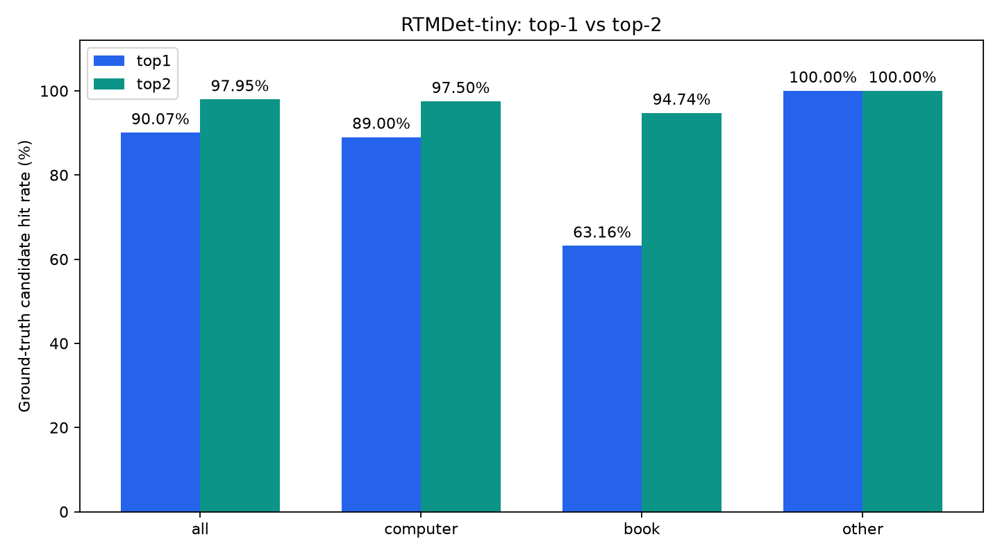

# RTMDet-tiny top-k 비교 결과

동일한 저장 탐지 결과에서 임계값을 통과한 MVP 그룹의 정답 포함률을 비교합니다.

전체 실행 결과 (원본 run.json의 smoke_test=false).

| 정답 그룹 | 이미지 수 | Top-1 | Top-2 | 증가 (%p) | 추가 정답 수 |
|---|---:|---:|---:|---:|---:|
| all | 292 | 90.07% | 97.95% | 7.88 | 23 |
| computer | 200 | 89.00% | 97.50% | 8.50 | 17 |
| book | 19 | 63.16% | 94.74% | 31.58 | 6 |
| other | 73 | 100.00% | 100.00% | 0.00 | 0 |

Top-2는 후보를 최대 두 개 허용한 포함률입니다. 단일 예측 정확도, precision/F1, 운영 수락·거절 오류율의 개선을 뜻하지 않습니다.
세 그룹 중 두 후보를 허용하므로 포함률은 구조적으로 상승할 수 있습니다. 학습이나 가중치 변경은 없습니다.

[집계 CSV](comparison.csv) · [설정 및 원본 탐지 SHA-256](comparison.json)
