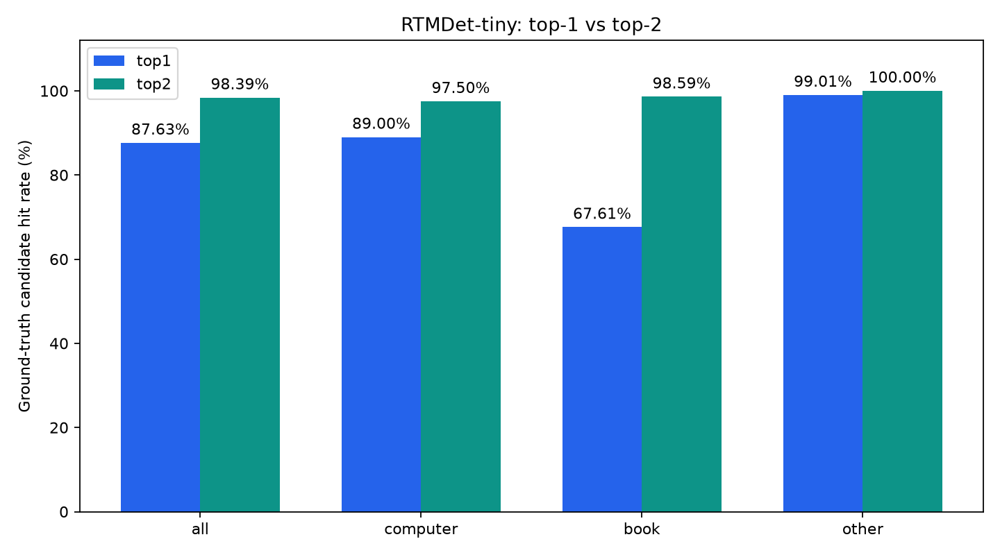

# RTMDet-tiny top-k 비교 결과

동일한 저장 탐지 결과에서 임계값을 통과한 MVP 그룹의 정답 포함률을 비교합니다.

전체 실행 결과 (원본 run.json의 smoke_test=false).

| 정답 그룹 | 이미지 수 | Top-1 | Top-2 | 증가 (%p) | 추가 정답 수 |
|---|---:|---:|---:|---:|---:|
| all | 372 | 87.63% | 98.39% | 10.75 | 40 |
| computer | 200 | 89.00% | 97.50% | 8.50 | 17 |
| book | 71 | 67.61% | 98.59% | 30.99 | 22 |
| other | 101 | 99.01% | 100.00% | 0.99 | 1 |

Top-2는 후보를 최대 두 개 허용한 포함률입니다. 단일 예측 정확도, precision/F1, 운영 수락·거절 오류율의 개선을 뜻하지 않습니다.
세 그룹 중 두 후보를 허용하므로 포함률은 구조적으로 상승할 수 있습니다. 학습이나 가중치 변경은 없습니다.

[집계 CSV](comparison.csv) · [설정 및 원본 탐지 SHA-256](comparison.json)

## 등록 카테고리별 수락/거절

| 카테고리 | k | Accuracy | Precision | Recall | FPR | FNR |
|---|---:|---:|---:|---:|---:|---:|
| computer | 1 | 93.28% | 98.34% | 89.00% | 1.74% | 11.00% |
| book | 1 | 93.55% | 97.96% | 67.61% | 0.33% | 32.39% |
| computer | 2 | 93.28% | 90.70% | 97.50% | 11.63% | 2.50% |
| book | 2 | 80.38% | 49.30% | 98.59% | 23.92% | 1.41% |

폴더의 단일 정답 기준입니다. 사진에 여러 대상이 함께 있으면 오수락이 과대 집계될 수 있습니다.
[카테고리별 CSV](category-verification.csv)
