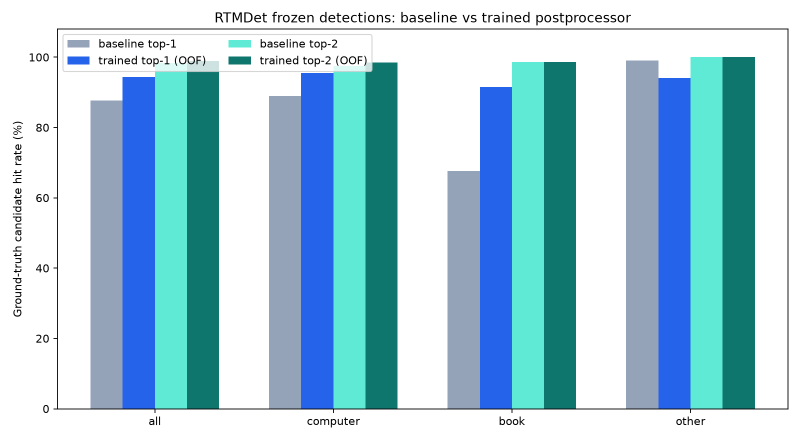
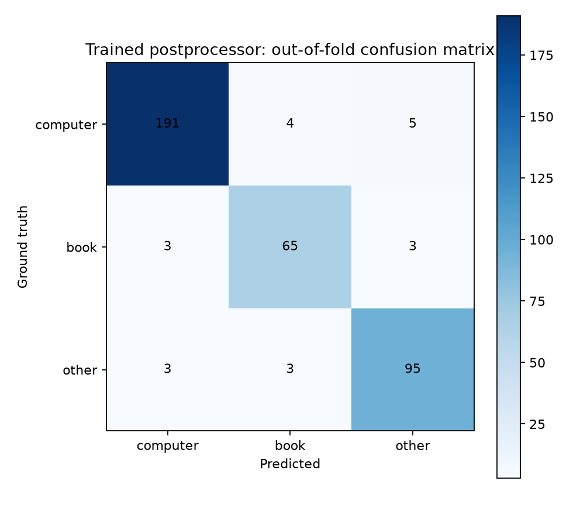

# RTMDet 탐지 특징 학습 및 top-k 보고서

RTMDet-tiny의 COCO 가중치는 고정하고, 저장된 탐지 결과의 클래스별 최대 점수와 탐지 수를 특징으로 사용해
computer/book/other 이미지 분류기를 학습했습니다. 탐지기 fine-tuning 결과가 아닙니다.

## 핵심 결과

| 모델 | Top-1 | Top-2 정답 포함률 |
|---|---:|---:|
| 기존 규칙 | 87.63% | 98.39% |
| 학습 후처리기 (OOF) | 94.35% | 98.92% |

Top-1은 6.72%p, top-2는 0.54%p 상승했습니다.
학습 지표는 각 이미지를 학습에서 제외한 5-fold out-of-fold 예측으로 계산했습니다.

## 클래스별 out-of-fold 결과

| 클래스 | 이미지 | Precision | Recall | F1 | Top-2 포함률 |
|---|---:|---:|---:|---:|---:|
| computer | 200 | 96.95% | 95.50% | 96.22% | 98.50% |
| book | 71 | 90.28% | 91.55% | 90.91% | 98.59% |
| other | 101 | 92.23% | 94.06% | 93.14% | 100.00% |

## 등록 카테고리 수락 지표

| 방식 | 카테고리 | k | Precision | Recall | FPR | FNR |
|---|---|---:|---:|---:|---:|---:|
| 기존 규칙 | computer | 1 | 98.34% | 89.00% | 1.74% | 11.00% |
| 기존 규칙 | book | 1 | 97.96% | 67.61% | 0.33% | 32.39% |
| 기존 규칙 | computer | 2 | 90.70% | 97.50% | 11.63% | 2.50% |
| 기존 규칙 | book | 2 | 49.30% | 98.59% | 23.92% | 1.41% |
| 학습 후처리기 (OOF) | computer | 1 | 96.95% | 95.50% | 3.49% | 4.50% |
| 학습 후처리기 (OOF) | book | 1 | 90.28% | 91.55% | 2.33% | 8.45% |
| 학습 후처리기 (OOF) | computer | 2 | 76.06% | 98.50% | 36.05% | 1.50% |
| 학습 후처리기 (OOF) | book | 2 | 28.57% | 98.59% | 58.14% | 1.41% |

학습 후처리기의 top-1은 recall을 높였지만 FPR도 증가했습니다. Top-2는 항상 두 후보를 내므로 FPR이 크게 증가하며 검토 후보 제시에만 사용해야 합니다.

## 해석 범위

- 원본 451개 파일에서 정확한 중복을 제거한 372장을 사용했습니다.
- 폴더의 단일 라벨만 사용했습니다. 객체별 박스 주석은 없습니다.
- 별도 외부 테스트셋이 없으므로 새로운 촬영 환경의 성능을 보장하지 않습니다.
- 최종 모델은 372장 전체로 다시 학습했으며, 보고된 성능은 해당 최종 모델의 학습 정확도가 아니라 OOF 추정치입니다.
- Top-2는 후보 두 개 중 정답 포함 여부이며 단일 승인 정확도가 아닙니다.

## 산출물

- `metrics.json`: 설정, fold별 선택값, 전체 지표, 해시
- `oof-predictions.csv`: 경로를 제외한 이미지 해시별 OOF 예측
- `per-class.csv`, `binary-topk.csv`, `by-source.csv`: 세부 지표
- `models/trained/rtmdet_topk_postprocessor.joblib`: 전체 데이터로 학습한 배포용 후처리기
